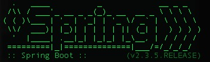

# openfeign
This is my very simple Web Application using Spring Cloud OpenFeign technology.
The following web application provides a REST Full Endpoint to check an account balance using the method GET, called /available-account-balance. In the same time there is another endpoint which a client consumes the previews endpoint. The client consumer can be accessed by /openfeign-get-account-balance.

## What is it for?
[Spring Cloud OpenFeign](https://cloud.spring.io/spring-cloud-openfeign/reference/html/) enables you to build Spring Boot applications that needs to integrate with other secure REST Full web service.

## How to run this application?
Preparing your system operation with the following:
* [installing Java SE](https://docs.oracle.com/javase/8/docs/technotes/guides/install/install_overview.html)
* [installing Apache Maven](https://maven.apache.org/install.html)
* [Installing Git](https://github.com/git-guides/install-git)

## How to run this application in your environment?
*This step depends on the previews installation.*

In your system operation, please, open your CLI (MacOS Terminal or Linux bash shell or Windows prompt) and type the following commands:
```
git clone https://github.com/alexandre1202/openfeign.git
mvn spring-boot:run
```
If everything has been done successfully the following picture will be displayed in your console:


## How to start this application in your browser
*This step depends on the previews installation.*

[Click to run it](http://localhost:8080/openfeign-get-account-balance)

## How to stop this application
*This step depends on the previews installation.*

- close the CLI console with the following picture:



